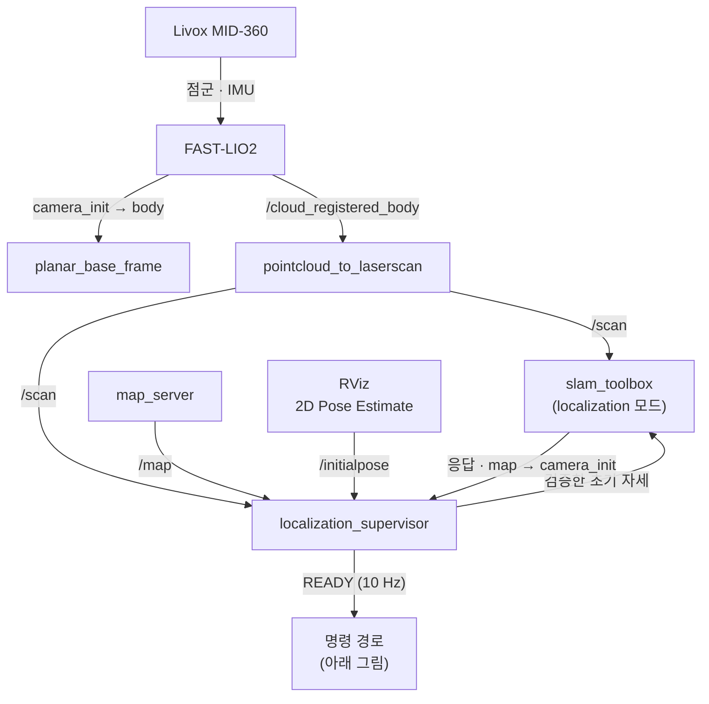
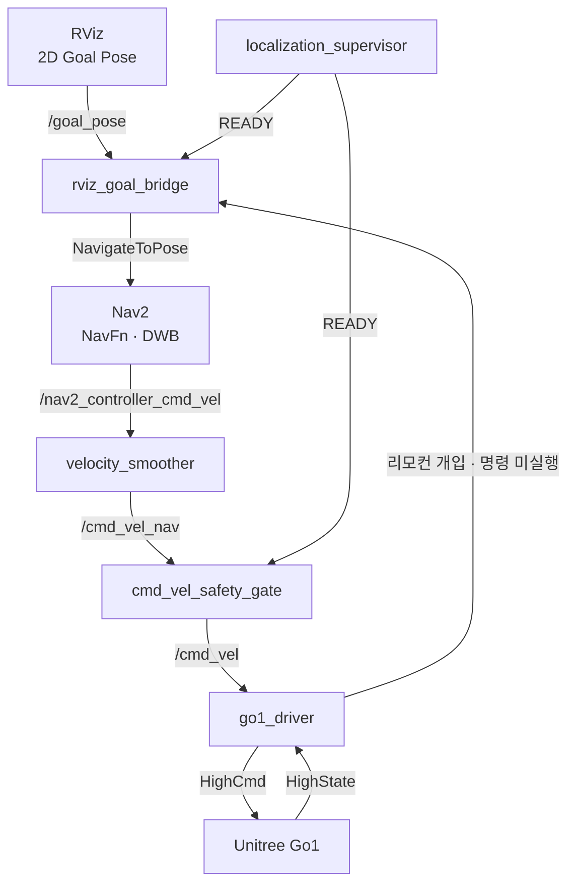
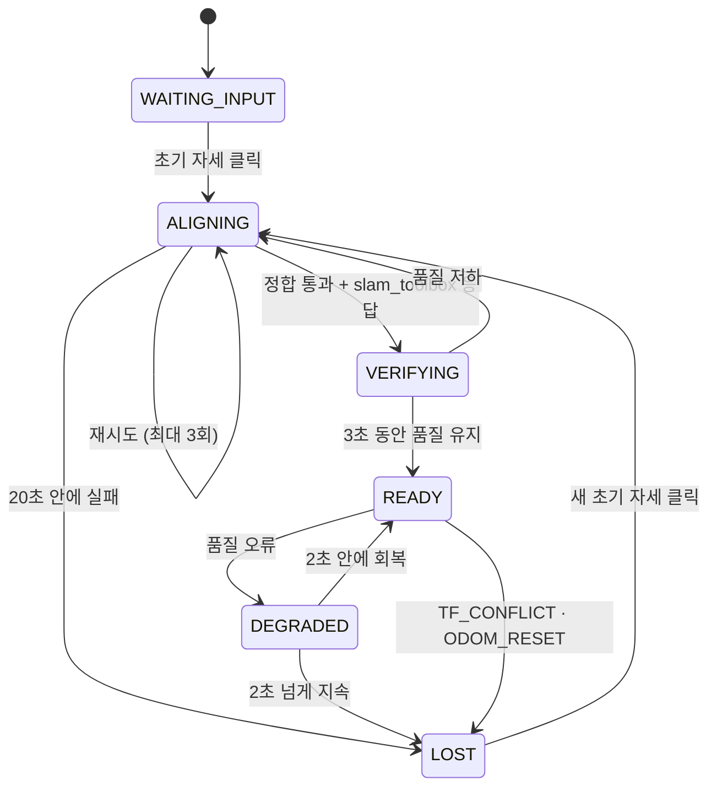

# Go1 ROS 2 — 저장 지도 위 pose-graph localization + Nav2 자율주행

Unitree Go1에 Livox MID-360을 달고, Jetson AGX Orin(Ubuntu 22.04, ROS 2 Humble)에서
**미리 만든 한양대 9층 지도 위를 Nav2로 주행**하는 스택입니다. RViz에서 대략적인 초기
위치를 한 번 찍으면 스캔-지도 정합으로 정확한 위치를 찾고, 위치가 확실하고 로봇이
명령을 따르고 있을 때만 움직이도록 여러 겹의 안전 장치를 둡니다.

> [!IMPORTANT]
> **현재 상태 (2026-09-22).** 2026-09-18 첫 armed 주행에서 드러난 문제를 모두 고쳤고,
> 노트북에서 그날의 기록을 실제 slam_toolbox·Nav2가 포함된 전체 스택에 폐루프로
> 재생해 검증했습니다. **수정본은 아직 로봇에서 주행하지 않았습니다.** 다음 현장 시험
> 순서는 [`migration/FIELD_SESSION_2026-09-18.md`](migration/FIELD_SESSION_2026-09-18.md)
> 끝에 있습니다. 모든 launch의 기본값은 `arm:=false`(무구동)입니다.

## 목차

1. [한눈에 보기](#1-한눈에-보기)
2. [시스템 구조](#2-시스템-구조)
3. [알고리즘](#3-알고리즘)
4. [안전 설계](#4-안전-설계)
5. [현장 실행 방법](#5-현장-실행-방법)
6. [상태 읽는 법](#6-상태-읽는-법)
7. [검증과 분석 도구](#7-검증과-분석-도구)
8. [현장 기록과 알려진 한계](#8-현장-기록과-알려진-한계)
9. [저장소 구조](#9-저장소-구조)
10. [지도](#10-지도)
11. [더 자세한 문서](#11-더-자세한-문서)

---

## 1. 한눈에 보기

| 항목 | 사용한 것 |
|---|---|
| 로봇 | Unitree Go1, High-level UDP 제어 (`unitree_legged_sdk` v3.8.6 Python wrapper) |
| 센서 | Livox MID-360 (360° LiDAR + 내장 IMU) |
| 컴퓨터 | NVIDIA Jetson AGX Orin 64GB, Ubuntu 22.04, ROS 2 Humble |
| 오도메트리 | FAST-LIO2 (LiDAR-관성 오도메트리) |
| 지도 위 위치 추정 | slam_toolbox **localization 모드** + 매핑 때 저장한 pose graph |
| 초기 정합 · 위치 감시 | `localization_supervisor` (자체 개발) |
| 경로 계획 | Nav2 NavFn (Dijkstra) + Simple Smoother |
| 경로 추종 | Nav2 DWB (전진 ≤ 0.20 m/s, 회전 ≤ 0.40 rad/s, 옆걸음 없음) |
| 로봇 구동 | `go1_driver` (자체 개발, 100 Hz) |
| 지도 | 한양대 9층, 약 20.5 × 29.3 m, 0.05 m/px (매핑 세션 `20260728_204825`) |

핵심 아이디어는 세 가지입니다.

- **역할 분리.** FAST-LIO2는 "켠 순간부터 얼마나 움직였나"(`camera_init → body`)만,
  slam_toolbox는 "그 원점이 지도의 어디인가"(`map → camera_init`)만 책임집니다.
- **위치를 믿을 수 있을 때만 움직인다.** `localization_supervisor`가 스캔과 지도가 실제로
  맞는지 계속 채점해 READY 신호를 내고, 목표 입력과 속도 명령은 이 신호가 있을 때만
  통과합니다.
- **로봇이 따르고 있는지 확인한다.** Go1은 손 리모컨을 모든 외부 명령보다 우선합니다.
  driver는 로봇의 응답(HighState)과 실제 이동(FAST-LIO2)을 읽어, 사람이 조종 중이거나
  로봇이 명령을 따르지 않으면 즉시 멈추고 목표를 취소합니다.

---

## 2. 시스템 구조

### 2.1 데이터 흐름

**위치 추정 — 로봇이 지도 위 어디에 있는가**



**명령 경로 — 클릭 한 번이 걸음이 되기까지**



그림에서 생략한 연결:

- supervisor와 slam_toolbox 사이의 토픽은 `/slam_localization/initialpose`(보냄)와
  `/slam_localization/pose`(응답)입니다.
- `/scan`과 `/map`은 Nav2의 costmap에도 들어갑니다.
- FAST-LIO2의 `/Odometry`는 supervisor(오도메트리 리셋 감지), Nav2, driver(명령 대비 실제
  이동 비교)도 받습니다.
- driver의 리모컨 개입·명령 미실행 신호는 `/go1/manual_override`, `/go1/execution_fault`입니다.

### 2.2 TF 트리

```text
map ──(slam_toolbox)──▶ camera_init ──(FAST-LIO2)──────────▶ body       6-DoF, LiDAR/IMU 기준
                                     └─(planar_base_frame)──▶ body_nav   x, y, yaw만 — Nav2의 로봇 기준
```

| 변환 | 발행 노드 | 뜻 |
|---|---|---|
| `map → camera_init` | slam_toolbox (유일한 발행자) | 오도메트리 원점이 지도의 어디인가 — 위치 추정의 결과 |
| `camera_init → body` | FAST-LIO2 | 켠 순간부터의 6-DoF 이동 |
| `camera_init → body_nav` | `planar_base_frame` (20 Hz) | 위 변환에서 높이·롤·피치를 뺀 평면 자세 |

- `camera_init`은 Nav2의 odom 프레임입니다. 지역 costmap과 회복 동작은 위치 보정(`map →
  camera_init`의 점프)에 흔들리지 않는 매끄러운 프레임이 필요하기 때문입니다.
- FAST-LIO2를 다시 시작하면 `camera_init`이 새로 잡히므로 초기 자세를 다시 지정해야 합니다.

### 2.3 한 번의 주행 순서

1. MID-360과 FAST-LIO2를 켜고, 스택을 launch합니다 (무구동 dry-run 또는 armed).
2. 운영자가 RViz `2D Pose Estimate`로 로봇 위치를 대략 클릭합니다 → `/initialpose`.
3. supervisor가 클릭 주변을 탐색해 스캔이 지도에 가장 잘 맞는 자세를 찾고, 결과가
   확실할 때만 slam_toolbox에 보냅니다.
4. slam_toolbox가 그 자세 근처에서 저장된 pose graph에 스캔을 맞추고 `map →
   camera_init`을 발행합니다.
5. supervisor가 3초 동안 품질을 확인한 뒤 **READY**가 되고 `ready=true`를 10 Hz로 냅니다.
6. 운영자가 `2D Goal Pose`를 클릭하면 `rviz_goal_bridge`가 READY일 때만 Nav2에 목표를 보냅니다.
7. Nav2 경로 계획·추종 → velocity smoother → 속도 게이트(READY일 때만 통과) →
   `go1_driver` → Go1.
8. 주행 중 supervisor는 정합 품질과 드리프트를, driver는 리모컨 개입과 명령 미실행을
   감시합니다. 문제가 생기면 목표를 취소하고 멈춥니다.

### 2.4 노드

| 노드 | 패키지 | 하는 일 |
|---|---|---|
| `livox_lidar_publisher` | `livox_ros_driver2` (외부) | MID-360 점군·IMU 발행 |
| `laser_mapping` | FAST-LIO2 (외부) | `/Odometry`, `/cloud_registered_body`, `camera_init → body` |
| `planar_base_frame` | `omx_navigation` | `camera_init → body_nav` 평면 프레임 |
| `pointcloud_to_laserscan` | 외부 | 점군 → 2D `/scan` |
| `map_server` | Nav2 | 주행 지도 `/map` (정리된 `hanyang_9f_annotated`) |
| `slam_toolbox` | 외부 | 저장 pose graph 기반 localization, `map → camera_init` |
| `localization_supervisor` | `omx_navigation` | 초기 정합, 상태 기계, 품질·드리프트 감시, READY 신호 |
| `bt_navigator`, `planner_server`, `controller_server`, `smoother_server`, `behavior_server`, `waypoint_follower`, `velocity_smoother` | Nav2 | 목표 실행 |
| `rviz_goal_bridge` | `omx_navigation` | RViz 목표 → `NavigateToPose`의 **유일한** 경로, 상태·마커 발행 |
| `cmd_vel_safety_gate` | `omx_navigation` | READY일 때만 `/cmd_vel_nav` → `/cmd_vel` |
| `go1_driver` | `go1_driver` | 속도 제한·watchdog, Unitree UDP, 리모컨·명령 미실행 감시 |

주행 스택 전체는 [`go1_posegraph_navigation.launch.py`](packages/omx_navigation/launch/go1_posegraph_navigation.launch.py)
하나로 뜨고(MID-360과 FAST-LIO2는 별도 터미널), 현장에서는 이것을 감싼
[`migration/jetson_field_deploy.sh`](migration/jetson_field_deploy.sh)로 실행합니다.

---

## 3. 알고리즘

### 3.1 FAST-LIO2 — LiDAR-관성 오도메트리

- **방식:** 반복 오차상태 칼만 필터(iterated error-state Kalman filter)가 IMU 적분으로
  자세를 예측하고, LiDAR 점과 지도 평면 사이의 거리(점-평면 잔차)로 갱신합니다. 두 센서를
  하나의 필터에서 함께 푸는 tightly-coupled 방식이고, 지도는 증분 k-d tree(ikd-tree)에
  쌓습니다.
- **설정** ([`fast_lio_mid360_navigation.yaml`](packages/omx_navigation/config/fast_lio_mid360_navigation.yaml)):
  MID-360(10 Hz), 3점 중 1점 사용, 0.5 m 다운샘플, 3회 반복, LiDAR-IMU 외부 파라미터 온라인
  추정. 주행용이라 지도·경로 출력은 끕니다.
- **역할의 한계:** 저장 지도를 불러와 위치를 찾지 않습니다. 켠 순간(`camera_init`)부터의
  상대 이동만 추정하고, 지도 위 위치는 slam_toolbox가 맡습니다.

### 3.2 평면 기준 프레임 — `planar_base_frame`

4족 보행 몸체는 걸을 때 롤·피치로 흔들립니다. FAST-LIO2의 6-DoF `body`를 그대로 쓰면
2D 스캔과 Nav2가 기울어진 평면을 보게 됩니다. 이 노드는 `camera_init → body`에서
**x, y, yaw만 남기고** 높이·롤·피치를 버린 `camera_init → body_nav`를 20 Hz로 발행합니다.
FAST-LIO2의 TF는 건드리지 않습니다.

### 3.3 2D 스캔 — `pointcloud_to_laserscan`

`/cloud_registered_body`에서 `body_nav` 기준 높이 **−0.20 ~ 1.30 m** 띠의 점을 골라,
360°를 **0.5°** 간격, **0.2–20 m** 범위의 `/scan`으로 만듭니다
([`mid360_scan.yaml`](packages/omx_navigation/config/mid360_scan.yaml)). 이 세 값은 지도를
만들 때의 투영 설정과 같아야 합니다. 달랐을 때는 스캔이 지도의 특징을 보지 못해 정합
점수가 평평해졌고(모호성 여유 0.010–0.027 < 필요 0.05) READY에 도달하지 못했습니다.

### 3.4 지도 위 위치 — slam_toolbox localization 모드

- 매핑 때 저장한 pose graph(`hanyang_9f.posegraph` + `.data`: 노드마다 스캔과 자세)를
  불러와, 새 스캔을 가까운 노드들의 스캔에 **상관 스캔 매칭**(correlative scan matching)으로
  맞춥니다. 탐색 창 0.5 m 격자(1 cm 해상도), 각도 ±20°(2° → 0.2° 단계), Ceres 최적화.
- 결과로 `map → camera_init`을 20 Hz로 발행합니다. loop closing은 꺼서 지도를 바꾸지 않습니다.
- 스캔은 로봇이 **0.10 m 또는 0.10 rad 이상 움직였을 때만** 처리합니다. 그래서 서 있는
  동안에는 위치를 고치지 않으며, 주행 중 쌓인 오차는 3.5의 드리프트 감시가 잡습니다.
- 초기 자세는 supervisor만 보냅니다: slam_toolbox의 `/initialpose`는
  `/slam_localization/initialpose`로, 자체 지도 토픽은 `/slam_localization/map`으로 옮겨
  `/map`에는 map_server의 주행 지도만 나옵니다.
- 설정: [`slam_toolbox_localization_hanyang_9f.yaml`](packages/omx_navigation/config/slam_toolbox_localization_hanyang_9f.yaml)

### 3.5 초기 정합과 위치 감시 — `localization_supervisor`

코드: [`localization_supervisor.py`](packages/omx_navigation/omx_navigation/localization_supervisor.py),
[`scan_map_quality.py`](packages/omx_navigation/omx_navigation/scan_map_quality.py),
[`localization_state.py`](packages/omx_navigation/omx_navigation/localization_state.py),
[`drift_monitor.py`](packages/omx_navigation/omx_navigation/drift_monitor.py)

**(1) 스캔-지도 점수.** 지도의 모든 칸에 대해 가장 가까운 벽까지의 거리를 미리 계산해
둡니다(8-이웃 Dijkstra 거리 변환). 어떤 후보 자세의 점수는 스캔 점(최대 180개, 고르게
추출)을 그 자세에 놓고 각 점이 벽에서 얼마나 떨어졌는지 읽어 계산합니다.

```text
overlap = (벽에서 0.25 m 이내에 떨어진 점의 수) / (사용한 점의 수)
score   = overlap − 0.2 × min(평균 거리, 1 m)
```

**(2) 초기 정합 (coarse search).** 클릭한 자세 주변을 격자로 전부 채점합니다.

| 항목 | 값 |
|---|---|
| 위치 | 반경 1.0 m 안을 0.5 m 간격 → 13곳 |
| 방향 | ±90°를 15° 간격 → 13개 |
| 후보 수 | 169개, 스캔이 지도 밖으로 나가는 후보는 탈락 |
| 채택 조건 | overlap ≥ 0.45, 그리고 1등과 **서로 다른** 2등(0.75 m 또는 20° 이상 떨어진 후보)의 점수 차 ≥ 0.05 |

두 번째 조건은 복도처럼 1 m 옆도 비슷해 보이는 곳에서 엉뚱한 자리에 잠기는 것을
막습니다. 반경을 3 m로 두었을 때는 복도의 2등 후보 때문에 READY에 가지 못해 기본값이
1.0 m입니다. 즉 **클릭은 실제 위치에서 1 m, 방향 90° 안**이어야 합니다. 통과한 자세는
slam_toolbox로 보냅니다(Jetson에서 탐색에 약 3초).

**(3) slam_toolbox의 응답 확인.** slam_toolbox는 받은 자세 근처에서 스캔을 다시 맞추고
`/slam_localization/pose`로 답합니다. 이때 쓰는 스캔은 푸시 뒤 처음 *도착한* 것이라
보통 푸시보다 50–100 ms 먼저 찍힌 것입니다. 답이 보낸 자세에서 0.5 m / 10° 안에
떨어지면 시각이 앞서도 응답으로 인정합니다. 서 있는 로봇에게는 이 답이 유일하기
때문입니다(2026-09-22 수정 — 전에는 절반쯤 버려져 재시도하다 `LOST`가 될 수 있었습니다).

**(4) 상태 기계.**



`ready=true`는 READY일 때만 나갑니다. 다른 모든 상태에서는 속도 게이트가 닫히고 목표가
거부·취소됩니다.

**(5) READY 동안의 감시.**

| 검사 | 기준 | 오류 |
|---|---|---|
| 입력이 살아 있는가 | 스캔·오도메트리·TF가 0.5 s 안에 도착 | `INPUT_MISSING` (+ 무엇이 없는지 `missing_inputs`) |
| 스캔이 지도와 맞는가 | TF로 합성한 현재 자세에서 최신 스캔의 overlap ≥ 0.45 | `LOW_OVERLAP` |
| 위치가 튀지 않는가 | `map → camera_init`이 한 번에 0.30 m / 10° 이하로 변함. 단, 방금 보낸 보정이 도착한 점프는 인정 | `TF_CONFLICT` |
| 오도메트리가 재시작되지 않았는가 | 3 m/s를 넘는 순간 이동 없음 (FAST-LIO2 재시작 감지) | `ODOM_RESET` |
| 다른 위치 추정기가 없는가 | AMCL 노드가 없음 | `TF_CONFLICT` |
| 위치가 서서히 틀어지지 않는가 | 아래 드리프트 감시 | `POSE_DRIFT` |

**(6) 드리프트 감시와 자동 보정.** slam_toolbox는 서 있을 때 위치를 고치지 않아, 주행 중
생긴 작은 오차(2026-09-18 복도 끝에서 방향 3–4.5°, 옆으로 약 0.25 m)가 그대로 남았습니다.
그래서 supervisor가 직접 확인합니다.

1. 2초마다 현재 추적 자세 주변을 국소 탐색합니다. 좌표 방향으로 한 칸씩 옮겨 보며
   점수가 좋아지는 쪽으로 가는 패턴 탐색이고, 걸음을 0.20 → 0.10 → 0.05 → 0.025 m,
   4° → 2° → 1° → 0.5°로 줄여 가며 0.35 m / 6° 범위 안에서 약 46번 채점합니다.
2. "근처에 있는 더 잘 맞는 자세"와 현재 자세의 점수 차가 **`consistency_gap`**입니다.
   정상 추적에서는 작고(현장 기록 p90 0.032), 틀어지면 커집니다(p10 0.12).
3. 연속 3번 0.08을 넘고, 세 번이 가리키는 보정(`map → camera_init` 기준)의 방향이 2° 안에서
   일치하면, 그 중앙값으로 고친 자세를 slam_toolbox에 보냅니다(10초 간격, 60초에 최대 3회).
4. 보정으로도 12초 넘게 해결되지 않으면 `POSE_DRIFT`로 멈춥니다.
   `drift_auto_correct:=false`로 자동 보정만 끌 수 있습니다.

2026-09-18 기록을 재생했을 때 복도 끝 구간에서 overlap이 0.7 아래인 시간이 88%에서 11%로
줄었고, 잘 달리던 구간의 품질은 그대로였습니다([자세한 수치](migration/FIELD_SESSION_2026-09-18.md)).

### 3.6 경로 계획과 추종 — Nav2

설정: [`nav2_posegraph_params.yaml`](packages/omx_navigation/config/nav2_posegraph_params.yaml)

| 구성 | 사용한 것 | 주요 값 |
|---|---|---|
| 전역 costmap (`map`) | 정적 지도 + `/scan` 장애물 + 팽창 | 0.05 m, 팽창 0.30 m, 미관측 칸은 통과 불가 |
| 지역 costmap (`camera_init`) | `/scan` 장애물 + 팽창, 로봇 중심 이동 창 | 4 × 4 m, 0.05 m, 장애물 0.20–2.0 m |
| 로봇 외곽 | 사각형 | 0.74 × 0.38 m |
| 전역 계획 | NavFn (Dijkstra, `use_astar: false`) | 목표 허용 0.20 m |
| 경로 다듬기 | Simple Smoother | |
| 경로 추종 | DWB: 속도 후보(전진 10 × 회전 20)를 2초 앞까지 굴려 보고 비평가 점수로 선택 | 전진 0–0.20 m/s, 회전 ≤ 0.40 rad/s, 옆걸음 0 |
| DWB 비평가 | RotateToGoal, Oscillation, BaseObstacle, GoalAlign, PathAlign, PathDist, GoalDist | |
| 속도 평활 | velocity_smoother (open loop, 10 Hz) | 가속 0.5 m/s², 1.0 rad/s², 후진 최대 0.10 m/s |
| 도착·진행 판정 | 도착 0.20 m / 0.15 rad, 20초 동안 0.15 m 못 가면 실패 | |
| 회복 동작 | spin, backup, drive_on_heading, wait | |

Go1은 옆걸음이 가능하지만 Nav2에서는 차동구동 로봇처럼 전진·후진·제자리 회전만 씁니다.
`nav2_bringup`의 launch를 쓰지 않고 노드를 직접 띄우는 이유는, 속도 토픽 연결
(`/nav2_controller_cmd_vel → velocity_smoother → /cmd_vel_nav`)과 `bt_navigator`의
`goal_pose` 차단을 확실히 제어하기 위해서입니다.

### 3.7 목표 입력 — `rviz_goal_bridge`

- Humble의 `bt_navigator`는 원래 `goal_pose`를 직접 구독합니다. 그대로 두면 클릭이 Nav2에
  두 번 들어가고 준비 검사를 우회했기 때문에(2026-09-18), launch에서 그 구독을 끊었고
  **목표는 이 브리지로만** 들어갑니다.
- READY가 아니거나, 리모컨 조종 중(`/go1/manual_override`)이거나, 로봇이 명령을 따르지 않으면
  (`/go1/execution_fault`) 클릭을 거부합니다. 주행 중 그런 일이 생기면 목표를 취소합니다.
- 새 클릭은 진행 중인 목표를 대체합니다(선점, `PREEMPTED`).
- 모든 상태 변화를 `/navigation/goal_status`(JSON)와 RViz 마커(`/navigation/goal_marker`)로
  보여 줍니다: 노랑 진행 중, 초록 `ARRIVED`, 빨강 `IGNORED:`/`CANCELED:` + 이유, 회색 `PREEMPTED`.

### 3.8 속도 게이트 — `cmd_vel_safety_gate`

Nav2의 `/cmd_vel_nav`를 `/cmd_vel`로 넘기는 단 하나의 통로입니다. 마지막 `ready=true`가
**0.30 s 이내**이고 마지막 명령도 0.30 s 이내일 때만 통과시키고, 아니면 0을 냅니다.
supervisor나 Nav2가 멈추거나 죽어도 로봇에는 정지 명령이 갑니다.

### 3.9 로봇 구동 — `go1_driver`

코드: [`packages/go1_driver`](packages/go1_driver) · 설정: [`go1_driver.yaml`](packages/go1_driver/config/go1_driver.yaml)

- **명령 필터 (100 Hz):** 전진 속도 0.20 m/s, 회전 0.40 rad/s로 제한하고, 아주 작은 값은
  0으로 봅니다(0.025 m/s, 0.04 rad/s). 0.35 s 동안 명령이 없거나 값이 비정상이면 선 자세
  (`mode 0`)로 둡니다. 움직일 때만 걷기(`mode 2`)를 보냅니다.
- **무구동(dry-run):** `arm:=false`이면 SDK를 열지 않고 적용될 명령만 발행합니다
  (`/go1/cmd_vel_applied`, `/go1/control_state = DRY-RUN`).
- **armed:** 정확한 확인 토큰이 있어야 UDP(192.168.123.161:8082)를 엽니다.
- **로봇 상태 읽기:** 매 주기 HighState를 해석해 모드, 속도, 배터리, `rangeObstacle`,
  리모컨 스틱·버튼을 `/go1/robot_state`(JSON, 10 Hz)로 냅니다. 0.5 s 넘게 새 응답이 없으면
  링크 끊김으로 봅니다.
- **누가 조종하는가 (중재):** 스틱이 0.10 넘게 기울거나 버튼이 눌리면 사람 조종으로 보고
  선 자세를 유지합니다(`/go1/manual_override`). 리모컨이 1초 쉬면 해제되지만, 그 뒤에도
  `/cmd_vel`이 0.5 s 동안 0이 되기 전에는 움직이지 않습니다. 사람이 조종하기 전에 받은
  목표가 저절로 이어지지 않게 하기 위해서입니다.
- **명령대로 움직이는가 (실행 감시):** 최근 3초 동안의 명령 이동량과 FAST-LIO2로 측정한
  실제 이동량을 비교합니다. 0.20 m 또는 25° 이상 명령했는데 25% 미만만 움직인 상태가
  5초 이어지거나, 명령이 없는데 0.60 m 또는 45° 이상 움직인 상태가 1초 이어지면
  `/go1/execution_fault`를 내고 멈춥니다.
- **종료:** `Ctrl-C` 때 선 자세 명령을 30번 반복해 보냅니다.

---

## 4. 안전 설계

한 층이 실패해도 다음 층이 막도록 겹쳐 두었습니다.

| 층 | 막는 것 | 위치 |
|---|---|---|
| 확인 토큰 | 실수로 켜는 armed 실행 | launch와 `go1_driver`가 각각 `GO1_ARMED_AND_ESTOP_READY` 검사 |
| preflight | 오래된 빌드, 다른 프로젝트의 ROS 환경, 빠진 지도·pose graph, 비활성 map_server, 남은 노드, 센서 없음 | `jetson_field_deploy.sh`, `verify_posegraph_navigation.sh` |
| 위치 신뢰 | 틀린 위치로 주행 | `localization_supervisor` (3.5) |
| 목표 게이트 | READY 전·리모컨 조종 중·명령 미실행 중의 목표 | `rviz_goal_bridge` (3.7) |
| 속도 게이트 | 신선한 READY 없이 나가는 속도 | `cmd_vel_safety_gate` (3.8) |
| 명령 필터 | 과속, 끊긴 명령, 비정상 값 | `go1_driver` (0.20 m/s, 0.40 rad/s, 0.35 s) |
| 중재·실행 감시 | 사람이 조종하는 로봇에 계속 명령하기, 명령을 따르지 않는 로봇 | `go1_driver` (3.9) |
| 기록 | 사고 뒤 원인 불명 | armed 실행은 진단 녹화를 반드시 켬 |
| 사람 | 위의 모든 것 | 물리 e-stop 담당자, 첫 목표 0.3 m 이내 |

---

## 5. 현장 실행 방법

Jetson 기본 경로: 저장소 `/mnt/t500/GO1_to_ROS2_YEEPY`, ROS 2 workspace
`/mnt/t500/go1_ros2_ws`, Go1 ROS 도메인 **100**.

> [!WARNING]
> Jetson은 다른 프로젝트와 공유합니다. 로그인 셸(`~/.bashrc`)이 그 프로젝트의
> workspace(`~/nav_ws`)와 `ROS_DOMAIN_ID=84`를 불러옵니다. 배포·검증 스크립트는 이를
> 스스로 지우고 도메인 100을 쓰지만, 손으로 치는 `ros2` 명령은 매번 아래처럼 환경을
> 명시하십시오.
>
> ```bash
> source /opt/ros/humble/setup.bash
> source /mnt/t500/go1_ros2_ws/install/setup.bash
> export ROS_DOMAIN_ID=100
> ```

### 5.1 배포와 빌드

```bash
cd /mnt/t500/GO1_to_ROS2_YEEPY
./migration/jetson_field_deploy.sh stage "$PWD" /mnt/t500/go1_ros2_ws
./migration/build_unitree_go1_wrapper.sh /path/to/unitree_legged_sdk
./migration/jetson_field_deploy.sh build /mnt/t500/go1_ros2_ws
./migration/jetson_field_deploy.sh preflight /mnt/t500/go1_ros2_ws
bash migration/run_all_tests.sh
```

`build`는 두 패키지를 빌드·테스트하고 실패·skip·0개 수집을 모두 실패로 봅니다.
`preflight`는 aarch64, Ubuntu 22.04, Humble, 필수 패키지, ARM64 Unitree wrapper,
지도·pose graph, 설치 파일이 소스와 같은지(빌드 누락)를 검사합니다.

### 5.2 센서 (터미널 A, B)

```bash
# 터미널 A — MID-360
ros2 launch livox_ros_driver2 msg_MID360_launch.py

# 터미널 B — FAST-LIO2 (초기화하는 동안 로봇을 움직이지 마십시오)
ros2 launch fast_lio mapping.launch.py \
  config_path:=/mnt/t500/go1_ros2_ws/install/omx_navigation/share/omx_navigation/config \
  config_file:=fast_lio_mid360_navigation.yaml rviz:=false
```

`mapping.launch.py`라는 이름이지만 여기서는 오도메트리(`/Odometry`,
`/cloud_registered_body`, `camera_init → body`)를 얻는 용도입니다.

### 5.3 무구동 dry-run (터미널 C)

```bash
./migration/jetson_field_deploy.sh dry-run /mnt/t500/go1_ros2_ws
```

항상 `arm:=false`이고 진단 기록을 켭니다(`/mnt/t500/localization_logs/posegraph_*/`).
RViz는 같은 네트워크의 GUI PC에서 `ROS_DOMAIN_ID=100`으로 띄웁니다
(`rviz2 -d <omx_navigation share>/rviz/go1_existing_map_low_load.rviz`).

1. `2D Pose Estimate`로 로봇 위치를 **한 번** 대략 지정합니다(실제 위치에서 1 m, 90° 안).
2. 약 6초 뒤 `READY`/`NONE`, `ready=true`를 확인합니다
   (`./migration/verify_posegraph_navigation.sh ready`).
3. `2D Goal Pose`로 가까운 목표를 주고 경로와 `/cmd_vel`이 생기는지, 로봇이 움직이지
   않는지, 취소하면 0으로 돌아오는지 봅니다.
4. `Ctrl-C`로 끝내고 모든 노드가 exit 0인지 확인합니다.

### 5.4 armed 현장 시험

dry-run을 통과하고, Go1을 스탠드나 넓은 시험 공간에 두고, 물리 **e-stop** 담당자가
준비된 경우에만 실행합니다.

```bash
./migration/jetson_field_deploy.sh armed GO1_ARMED_AND_ESTOP_READY /mnt/t500/go1_ros2_ws
```

`ros2 launch ... arm:=true`로 직접 우회할 수 없습니다. launch가 `start_go1_driver`,
`record_localization`, 확인 토큰을 모두 검사하고 driver도 SDK를 열기 전에 다시 검사합니다.
새 프로세스이므로 초기 자세와 READY를 다시 확인한 뒤 **첫 목표는 0.3 m 이내**로 줍니다.
목표 취소, READY 상실, watchdog 정지, `Ctrl-C` 반복 stand, e-stop을 하나씩 확인하기 전에는
시험 반경을 늘리지 마십시오. **armed 중에는 리모컨을 만지지 마십시오.** 스틱을 움직이면
driver가 사람 조종으로 보고 목표를 취소합니다.

### 5.5 주행 후 분석 (ROS 없이, 노트북에서도)

```bash
python3 tools/session_report.py /mnt/t500/localization_logs/<session>/rosbag/rosbag_0.db3
python3 tools/replay_localization.py drift /mnt/t500/localization_logs/<session>/rosbag/rosbag_0.db3
```

---

## 6. 상태 읽는 법

`/localization_supervisor/status`(JSON, 2 Hz, 세션 폴더의 `localization_status.csv`에도 기록):

| 필드 | 뜻 |
|---|---|
| `state` | `WAITING_INPUT` · `ALIGNING` · `VERIFYING` · `READY` · `DEGRADED` · `LOST` |
| `error` | 아래 오류 코드 |
| `overlap` | 현재 스캔이 지도 벽에 맞는 비율 (0–1, 정상 약 0.8) |
| `ambiguity_margin` | 잠글 당시 1등과 2등의 점수 차 (잠근 뒤에는 바뀌지 않음) |
| `consistency_gap` | 근처에 더 잘 맞는 자세가 있는 정도 (정상 < 0.08) |
| `drift_corrections` | 최근 보낸 드리프트 보정 수 (60초 창) |
| `tf_corrections_explained` | 자기 보정으로 인정한 TF 점프 수 |
| `missing_inputs` | `INPUT_MISSING`일 때 없는 것: `map`, `scan`, `odometry`, `initial_pose`, `alignment`, `slam_answer`, `tf`, `scan_match` |

| 오류 | 뜻 | 할 일 |
|---|---|---|
| `INPUT_MISSING` | 입력이 없거나 오래됨 | `missing_inputs` 확인. 클릭 직후 `slam_answer,tf`는 정상. `map,alignment`가 계속되면 map_server가 비활성 → launch 재시작 |
| `LOW_OVERLAP` | 스캔이 지도와 안 맞음 | 초기 자세를 다시 지정. 계속되면 지도·extrinsic 확인 |
| `AMBIGUOUS` | 비슷한 후보가 둘 | 특징이 보이는 곳에서 다시 지정 |
| `POSE_OUTSIDE_MAP` | 자세가 지도 밖이거나 크게 튐 | 초기 자세 다시 지정 |
| `ALIGNMENT_TIMEOUT` | 20초 안에 정합 실패 | 클릭 위치·방향 확인 후 다시 지정 |
| `TF_CONFLICT` | 설명되지 않는 위치 점프 또는 AMCL 동시 실행 | AMCL 등 다른 localization 종료 후 재시작 |
| `ODOM_RESET` | FAST-LIO2 재시작 | 초기 자세 다시 지정 |
| `POSE_DRIFT` | 보정으로도 해결되지 않는 드리프트 | 멈춘 뒤 초기 자세 다시 지정 |
| `EXTRINSIC_UNCALIBRATED` | 예약된 코드 (현재 supervisor는 내지 않음) | — |

오류가 있는 동안에는 속도 게이트가 닫혀 있으니 원인을 고치기 전에는 움직이지 마십시오.

---

## 7. 검증과 분석 도구

| 도구 | 하는 일 | ROS 필요 |
|---|---|---|
| `bash migration/run_all_tests.sh` | 전체 pytest를 한 번에 (Jetson 기준) | 선택 |
| `migration/verify_posegraph_navigation.sh preflight\|ready` | 실행 중 스택 점검: 토픽·주기·map_server active·READY·TF·lifecycle·`arm=false` | 예 |
| `migration/verify_cmd_vel_chain_go1_off.py` | Go1 전원을 끈 채 `/cmd_vel` 사슬과 속도 게이트 확인 | 예 |
| `migration/verify_control_chain_sim.py` | 가상 Unitree SDK + 가상 Nav2로 armed driver·목표 브리지 22개 항목 확인 | 예 |
| `migration/replay_field_bag.py` | 현장 bag의 센서 입력을 현재 시각으로 재생해 전체 스택을 폐루프로 검증 | 예 |
| `tools/session_report.py` | 세션 bag에서 목표 타임라인, 리모컨 개입, 명령 대비 실제 이동, localization 요약 | 아니오 |
| `tools/replay_localization.py` | supervisor의 채점·드리프트 판단을 bag에 다시 적용 | 아니오 |
| `migration/diagnose_go1_walk.py` | Go1이 UDP에는 답하는데 걷지 않을 때 원인(리모컨, 모드 소유) 확인 | 아니오 (SDK 필요) |

**2026-09-22 검증 결과 (로봇 없이):**

- Windows 전체 테스트 385 통과(리눅스 전용 1개 skip)
- WSL Ubuntu 22.04 · Python 3.10 · 실제 ROS 2 Humble: colcon test 349개 0 실패 0 skip,
  설치된 workspace 기준 전체 386 통과
- 제어 사슬 시뮬레이션 22/22
- 2026-09-18 기록의 첫 700초 폐루프 재생(실제 slam_toolbox·Nav2): 두 클릭 모두 첫 푸시에
  READY, 700초 내내 READY 유지, `TF_CONFLICT`·`POSE_DRIFT` 0회, 드리프트 보정 4회,
  클릭한 목표 3개가 각각 한 번씩만 Nav2에 도착

노트북에서 전체 스택을 재생하는 방법은 [`migration/README.md` §16](migration/README.md)에 있습니다.

---

## 8. 현장 기록과 알려진 한계

현장 기록: [2026-08-18](migration/FIELD_SESSION_2026-08-18.md),
[2026-09-18](migration/FIELD_SESSION_2026-09-18.md) — 측정값, 원인, 수정 내용, 다음 확인 순서.

알려진 한계:

- **로봇 미검증:** 2026-09-18 이후 수정은 기록 재생과 시뮬레이션으로만 검증했습니다.
  Unitree SDK의 `Recv()` 반환값, 리모컨이 켜져 있고 스틱이 가운데일 때 Go1의 동작은 아직 모릅니다.
- **지도 의존:** 저장된 지도와 pose graph 위에서만 위치를 찾습니다. 공간 배치가 크게
  바뀌면 overlap이 떨어지고, 그때는 지도를 다시 만들어야 합니다.
- **초기 자세 범위:** 클릭은 실제 위치에서 1 m, 90° 안이어야 합니다. 복도에서는 앞뒤
  위치가 약하게만 관측되어 모호성 판정에 걸릴 수 있습니다.
- **정지 중 보정 없음:** slam_toolbox는 서 있을 때 위치를 고치지 않습니다. 드리프트 감시가
  주행 중 쌓인 오차를 보완합니다.
- **리모컨 우선:** Go1은 켜진 리모컨을 외부 명령보다 우선합니다. driver가 감지해 멈추고
  목표를 취소할 뿐, 막을 수는 없습니다.
- **Go1 자체 장애물 센서:** Go1이 `rangeObstacle`로 전진을 거부할 수 있습니다.
  `/go1/robot_state`의 값을 확인하십시오.
- **느린 속도:** 전진 0.20 m/s, 회전 0.40 rad/s로 제한되어 있습니다.
- **Jetson 테스트:** 2026-09-18 Jetson에서는 전체 실행 시 22개가 실패했고 노트북에서는
  재현되지 않았습니다. 로그인 셸 환경이 원인으로 보여 차단했으며, `run_all_tests.sh`로
  다시 확인해야 합니다.

---

## 9. 저장소 구조

```text
.
├── packages/
│   ├── omx_navigation/                 # 위치 감시·목표·속도 게이트·launch·설정
│   │   ├── omx_navigation/
│   │   │   ├── localization_supervisor.py   # 초기 정합, 상태 기계, 품질·드리프트 감시
│   │   │   ├── scan_map_quality.py          # 거리 변환, 채점, coarse search, 국소 정제
│   │   │   ├── localization_state.py        # 상태 기계와 정책 값
│   │   │   ├── drift_monitor.py             # 드리프트 판단과 보정 정책
│   │   │   ├── pose_tracking.py             # 2D 자세 합성·차이
│   │   │   ├── planar_base_frame.py         # camera_init → body_nav
│   │   │   ├── rviz_goal_bridge.py          # RViz 목표 → NavigateToPose
│   │   │   ├── goal_gate.py                 # 목표 허용 정책
│   │   │   ├── cmd_vel_safety_gate.py       # READY 기반 속도 게이트
│   │   │   └── cmd_vel_gate_core.py
│   │   ├── launch/
│   │   │   ├── go1_posegraph_navigation.launch.py   # 현재 주행 스택
│   │   │   ├── go1_existing_map.launch.py           # 레거시 AMCL fallback (dry-run 전용)
│   │   │   ├── go1_mapping.launch.py                # 매핑용
│   │   │   └── rviz_navigation.launch.py
│   │   ├── config/                     # FAST-LIO2, scan 투영, slam_toolbox, Nav2 설정
│   │   ├── rviz/                       # 현장용 저부하 RViz 설정
│   │   └── test/
│   └── go1_driver/                     # Unitree Go1 구동
│       ├── go1_driver/
│       │   ├── node.py                 # ROS 노드, 100 Hz 루프
│       │   ├── command_filter.py       # 속도 제한·deadband·watchdog
│       │   ├── unitree_adapter.py      # Unitree SDK UDP 송수신
│       │   ├── robot_state.py          # HighState·리모컨 해석
│       │   ├── arbitration.py          # 사람 조종 중재, 0 명령 재무장
│       │   └── execution_monitor.py    # 명령 대비 실제 이동 감시
│       └── test/
├── maps/hanyang_9f/20260728_204825/    # 지도, pose graph, 매핑 검증 기록
├── migration/                          # Jetson 배포·검증 스크립트, 현장 기록
├── tools/                              # ROS 없이 쓰는 bag 분석·지도 정리 도구
└── docs/                               # 설계·레거시 문서
```

---

## 10. 지도

| 파일 | 용도 |
|---|---|
| `slam_toolbox/hanyang_9f_annotated.yaml` + `.pgm` | **주행 지도** (map_server, Nav2 costmap, supervisor 채점) |
| `slam_toolbox/hanyang_9f.posegraph` + `.data` | slam_toolbox localization이 불러오는 pose graph |
| `slam_toolbox/hanyang_9f.yaml` | 검증된 원본 SLAM 지도 |
| `slam_toolbox/hanyang_9f_cleaned.yaml` | 자동 정리 지도 |
| `pcd/`, `pcd2d/` | 3D 점군과 그 2D 투영 (참고용) |

지도는 2026-07-28 매핑 세션(FAST-LIO + slam_toolbox, 출발점 복귀 오차 0.07 m / 4.96°)으로
만들었습니다. 유리·반사로 의심되는 자유 공간은 보수적으로 미관측 처리했고
([`tools/clean_occupancy_map.py`](tools/clean_occupancy_map.py),
[`tools/apply_map_annotation.py`](tools/apply_map_annotation.py)), 벽을 새로 만들지는
않습니다. 자세한 내용은 [지도 README](maps/hanyang_9f/20260728_204825/README.md)에 있습니다.


---

## 11. 더 자세한 문서

| 문서 | 내용 |
|---|---|
| [`packages/omx_navigation/README.md`](packages/omx_navigation/README.md) | 내비게이션 패키지, 설정 값, 확인 명령 |
| [`packages/go1_driver/README.md`](packages/go1_driver/README.md) | driver 빌드, dry-run, armed, "Who is in control" |
| [`migration/README.md`](migration/README.md) | 새 Jetson 구축부터 현장 시험까지의 runbook, 전체 테스트, 폐루프 재생 |
| [`migration/FIELD_SESSION_2026-09-18.md`](migration/FIELD_SESSION_2026-09-18.md) | 첫 armed 주행 분석, 수정, 다음 현장 체크리스트 |
| [`docs/LEGACY_AMCL_RUNBOOK.md`](docs/LEGACY_AMCL_RUNBOOK.md) | 이전 README 본문: AMCL fallback, 터미널별 수동 실행, 문제 해결 |
| [`docs/GO1_NAV2_END_TO_END.md`](docs/GO1_NAV2_END_TO_END.md) | 매핑부터 AMCL 주행까지의 이전 전체 가이드 |
| [`ROS1_ARCHIVE.md`](ROS1_ARCHIVE.md) | ROS 1 시절 구성 기록 |
