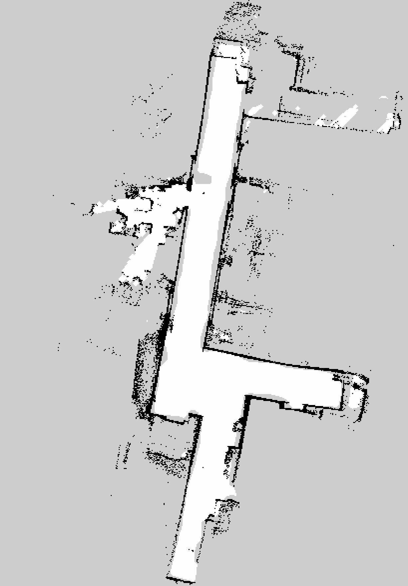
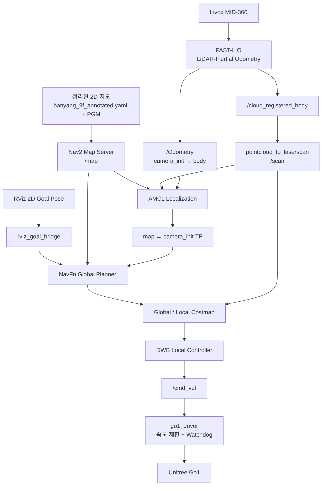

# Go1 ROS2 — 저장 지도 기반 Localization 및 Nav2 자율주행

Ubuntu 22.04 / ROS2 Humble 환경에서 Unitree Go1과 Livox MID-360을 이용하여, 이미 생성된 한양대 9층 2D 지도를 불러오고 AMCL localization과 Nav2를 통해 Go1을 자율주행시키는 절차입니다.

이 문서는 다음 조건을 전제로 합니다.

- `codex/hanyang-9f-mapping-pcl-fix` 브랜치에서 세션 `20260728_204825` 매핑을 완료했습니다.
- 검증된 원본 지도와 반사 영역을 정리한 최종 Nav2 지도가 이 브랜치의 `maps/` 아래에 포함되어 있습니다.
- 원본 지도 검증 결과는 `complete: true`, 출발점 복귀 오차는 약 `0.07 m`, `4.96 deg`입니다.
- 실제 주행은 `agent/nav2-end-to-end-workflow` 브랜치에서 수행합니다.
- Jetson에서 Livox, FAST-LIO, Nav2 및 Go1 driver를 실행합니다.
- 모든 터미널에서 동일한 `ROS_DOMAIN_ID=100`을 사용합니다.

---

## 1. 브랜치별 역할

| 단계 | 브랜치 | 역할 |
|---|---|---|
| 지도 생성 | `codex/hanyang-9f-mapping-pcl-fix` | FAST-LIO, 3D PCD, rosbag, SLAM Toolbox 2D 지도 생성 |
| Localization 및 자율주행 | `agent/nav2-end-to-end-workflow` | 저장 지도 로드, AMCL localization, Nav2 경로계획, Go1 제어 |

매핑이 이미 완료되었으므로 평상시 자율주행을 위해 매핑 브랜치를 다시 실행할 필요가 없습니다.

기본으로 사용할 최종 Nav2 지도는 다음 파일입니다.

```text
/mnt/t500/go1_ros2_project/maps/hanyang_9f/20260728_204825/slam_toolbox/hanyang_9f_annotated.yaml
```

같은 디렉터리에 다음 이미지 파일이 있어야 합니다.

```text
/mnt/t500/go1_ros2_project/maps/hanyang_9f/20260728_204825/slam_toolbox/hanyang_9f_annotated.pgm
```

지도 세션 상세 정보와 정리 보고서는
[`maps/hanyang_9f/20260728_204825/README.md`](maps/hanyang_9f/20260728_204825/README.md)에서 확인할 수 있습니다.



다음 파일들은 Nav2 주행용 지도로 사용하지 않습니다.

| 파일 | 용도 |
|---|---|
| `pcd/merged.pcd` | 전체 3D 점군 지도 확인 및 보관 |
| `pcd2d/geometry_reference.yaml` | 3D PCD 투영 결과 비교 |
| `slam_toolbox/hanyang_9f.yaml` | 검증된 원본 SLAM 지도 |
| `slam_toolbox/hanyang_9f_cleaned.yaml` | 자동 정리 지도 |
| `slam_toolbox/hanyang_9f.posegraph` | SLAM 수정 및 재개 |
| `slam_toolbox/hanyang_9f.data` | SLAM Toolbox pose graph 데이터 |

---

## 2. 전체 실행 구조



---

## 3. Localization 방식

주행 단계에서는 새로운 지도를 생성하는 SLAM을 실행하지 않습니다.

Localization은 저장된 2D 지도와 AMCL을 이용합니다.

AMCL의 입력:

```text
저장 지도: hanyang_9f_annotated.yaml + hanyang_9f_annotated.pgm
실시간 LaserScan: /scan
실시간 Odometry: /Odometry
초기 위치: RViz 2D Pose Estimate
```

AMCL은 저장 지도에서 Go1의 전역 위치를 추정하고 다음 TF를 생성합니다.

```text
map → camera_init
```

FAST-LIO는 다음 TF를 생성합니다.

```text
camera_init → body
```

따라서 전체 TF 구조는 다음과 같습니다.

```text
map → camera_init → body
```

각 프레임의 역할:

| 프레임 | 역할 |
|---|---|
| `map` | 저장된 2D 지도 기준 전역 프레임 |
| `camera_init` | FAST-LIO odometry 시작 프레임 |
| `body` | Go1/LiDAR 이동체 기준 프레임 |

주의할 점:

- FAST-LIO가 기존 `merged.pcd`를 불러와 localization하는 방식이 아닙니다.
- FAST-LIO는 실행할 때마다 현재 이동량과 자세를 추정합니다.
- 저장된 2D 지도상의 전역 위치는 AMCL이 추정합니다.
- FAST-LIO가 재시작되면 `camera_init` 기준이 초기화되므로 RViz에서 `2D Pose Estimate`를 다시 지정해야 합니다.

---

## 4. Nav2 주행 방식

RViz에서 `2D Goal Pose`를 지정하면 다음 순서로 처리됩니다.

```text
RViz /goal_pose
        ↓
rviz_goal_bridge
        ↓
NavigateToPose action
        ↓
NavFn global planner
        ↓
Global path
        ↓
DWB local controller
        ↓
/cmd_vel
        ↓
go1_driver
        ↓
Unitree High-Level UDP
        ↓
Go1 주행
```

현재 기본 주행 제한:

| 항목 | 설정값 |
|---|---:|
| 최대 전진 속도 | `0.20 m/s` |
| 최대 회전 속도 | `0.40 rad/s` |
| 횡방향 속도 | `0.0 m/s` |
| Go1 command watchdog | `0.35 s` |
| 로봇 반경 | `0.25 m` |

현재 Nav2 설정은 Go1을 차동구동 로봇처럼 사용합니다.

- 전진 및 후진
- 제자리 회전
- 횡방향 이동은 사용하지 않음
- 반사 의심 영역과 미관측 영역은 global path에서 통과하지 않음

---

# 사전 준비

## 5. 저장 지도 확인

저장소에 포함된 검증 세션과 최종 정리 지도를 사용합니다.

```bash
export GO1_PROJECT_ROOT="/mnt/t500/go1_ros2_project"
export SESSION_ID="20260728_204825"

export SESSION_DIR="$GO1_PROJECT_ROOT/maps/hanyang_9f/$SESSION_ID"
export MAP_DIR="$SESSION_DIR/slam_toolbox"
export MAP_FILE="$MAP_DIR/hanyang_9f_annotated.yaml"
export MAP_IMAGE="$MAP_DIR/hanyang_9f_annotated.pgm"
```

파일 확인:

```bash
test -s "$MAP_FILE"
test -s "$MAP_IMAGE"

ls -lh \
  "$MAP_FILE" \
  "$MAP_IMAGE"
```

지도 YAML 확인:

```bash
grep -E \
  '^(image|resolution|origin|negate|occupied_thresh|free_thresh):' \
  "$MAP_FILE"
```

정상적인 예:

```yaml
image: hanyang_9f_annotated.pgm
resolution: 0.05
```

매핑 검증 결과 확인:

```bash
grep -E \
  'status:|failed_step:|error:' \
  "$SESSION_DIR/validation/session_manifest.yaml"

grep -E \
  '^complete:|^needs_return_check:' \
  "$SESSION_DIR/validation/report.yaml"
```

정상 결과:

```text
status: complete
complete: true
needs_return_check: false
```

---

## 6. Nav2 브랜치 받기

저장 지도 주행에는 다음 브랜치를 사용합니다.

```text
agent/nav2-end-to-end-workflow
```

저장소 이동:

```bash
cd /mnt/t500/go1_ros2_project
```

현재 변경 사항 확인:

```bash
git status --short
```

출력이 없을 때 브랜치를 전환합니다.

```bash
git fetch origin
git switch agent/nav2-end-to-end-workflow
git pull --ff-only
```

로컬 브랜치가 아직 없다면:

```bash
git switch --track \
  origin/agent/nav2-end-to-end-workflow
```

확인:

```bash
git branch --show-current
git log -1 --oneline
```

예상 브랜치:

```text
agent/nav2-end-to-end-workflow
```

검증 지도는 이 브랜치의 `maps/` 디렉터리에 포함되어 있습니다. 별도 매핑
세션을 사용할 때는 `map:=` 인자로 해당 YAML 절대 경로를 전달합니다.

---

## 7. Nav2 및 Go1 패키지 배치

```bash
export GO1_PROJECT_ROOT="/mnt/t500/go1_ros2_project"
export GO1_ROS2_WS="$HOME/ros2_ws"

mkdir -p "$GO1_ROS2_WS/src/go1_driver"
mkdir -p "$GO1_ROS2_WS/src/omx_navigation"
```

Go1 driver 복사:

```bash
cp -a \
  "$GO1_PROJECT_ROOT/packages/go1_driver/." \
  "$GO1_ROS2_WS/src/go1_driver/"
```

Nav2 패키지 복사:

```bash
cp -a \
  "$GO1_PROJECT_ROOT/packages/omx_navigation/." \
  "$GO1_ROS2_WS/src/omx_navigation/"
```

---

## 8. 패키지 빌드

```bash
export GO1_ROS2_WS="$HOME/ros2_ws"
export ROS_DOMAIN_ID=100

source /opt/ros/humble/setup.bash
source "$HOME/ws_livox/install/setup.bash"

if [ -r "$GO1_ROS2_WS/install/setup.bash" ]; then
  source "$GO1_ROS2_WS/install/setup.bash"
fi

cd "$GO1_ROS2_WS"
```

의존성 설치:

```bash
rosdep install \
  --from-paths src \
  --ignore-src \
  -r \
  -y
```

빌드:

```bash
colcon build \
  --symlink-install \
  --packages-select go1_driver omx_navigation
```

환경 적용:

```bash
source "$GO1_ROS2_WS/install/setup.bash"
```

패키지 확인:

```bash
ros2 pkg prefix go1_driver
ros2 pkg prefix omx_navigation
ros2 pkg prefix fast_lio
ros2 pkg prefix livox_ros_driver2
```

---

# 자율주행 실행

## 9. 필요한 터미널

최소 3개의 터미널을 동시에 사용합니다.

```text
터미널 A: Livox MID-360
터미널 B: FAST-LIO
터미널 C: Map Server + AMCL + Nav2 + RViz + Go1 driver
```

선택적으로 상태 확인용 터미널 D를 추가할 수 있습니다.

```text
터미널 D: 토픽, TF, localization, cmd_vel 검증
```

모든 터미널에서 다음 값이 같아야 합니다.

```bash
export ROS_DOMAIN_ID=100
```

Livox, FAST-LIO 및 Go1 driver를 중복 실행하지 마십시오.

---

## 10. 기존 노드 중복 확인

새로운 주행을 시작하기 전에 실행합니다.

```bash
export ROS_DOMAIN_ID=100

source /opt/ros/humble/setup.bash
source "$HOME/ws_livox/install/setup.bash"
source "$HOME/ros2_ws/install/setup.bash"

ros2 node list
```

다음 노드가 이전 실행에서 남아 있으면 해당 터미널에서 `Ctrl-C`로 종료합니다.

```text
/livox_lidar_publisher
/laser_mapping
/amcl
/map_server
/controller_server
/planner_server
/go1_driver
/rviz2
```

---

## 11. 터미널 A — Livox MID-360

```bash
export GO1_ROS2_WS="$HOME/ros2_ws"
export ROS_DOMAIN_ID=100

source /opt/ros/humble/setup.bash
source "$HOME/ws_livox/install/setup.bash"
source "$GO1_ROS2_WS/install/setup.bash"

ros2 launch livox_ros_driver2 \
  msg_MID360_launch.py
```

이 터미널은 주행이 끝날 때까지 유지합니다.

### Livox 확인

별도의 상태 확인 터미널에서 실행합니다.

```bash
export ROS_DOMAIN_ID=100

source /opt/ros/humble/setup.bash
source "$HOME/ws_livox/install/setup.bash"
source "$HOME/ros2_ws/install/setup.bash"

timeout 10 ros2 topic hz /livox/lidar
timeout 10 ros2 topic hz /livox/imu
```

권장 최소 주파수:

| 토픽 | 권장 최소 |
|---|---:|
| `/livox/lidar` | `8 Hz` |
| `/livox/imu` | `100 Hz` |

일반적으로 정상적인 MID-360 출력 예:

```text
/livox/lidar 약 10 Hz
/livox/imu 약 200 Hz
```

---

## 12. 터미널 B — FAST-LIO

FAST-LIO 초기화 중에는 Go1을 정지 상태로 유지합니다.

```bash
export GO1_ROS2_WS="$HOME/ros2_ws"
export ROS_DOMAIN_ID=100

source /opt/ros/humble/setup.bash
source "$HOME/ws_livox/install/setup.bash"
source "$GO1_ROS2_WS/install/setup.bash"

ros2 launch fast_lio \
  mapping.launch.py \
  config_path:="$GO1_ROS2_WS/install/omx_navigation/share/omx_navigation/config" \
  config_file:=fast_lio_mid360_navigation.yaml \
  rviz:=false
```

이름은 `mapping.launch.py`이지만, 저장 지도 주행 단계에서는 다음 실시간 정보를 얻기 위해 사용합니다.

```text
/Odometry
/cloud_registered_body
camera_init → body TF
```

기존 3D PCD 지도를 불러오는 용도는 아닙니다.

이 터미널도 주행이 끝날 때까지 유지합니다.

### FAST-LIO 확인

```bash
timeout 10 ros2 topic hz /Odometry
timeout 10 ros2 topic hz /cloud_registered_body
```

TF 확인:

```bash
timeout 10 ros2 run tf2_ros \
  tf2_echo camera_init body
```

정상 조건:

- `/Odometry`가 약 `10 Hz`로 발행됩니다.
- `/cloud_registered_body`가 약 `10 Hz`로 발행됩니다.
- `camera_init → body` TF가 지속적으로 출력됩니다.
- Go1 또는 LiDAR를 움직이면 odometry 값이 변합니다.

FAST-LIO 출력이 확인되기 전에는 Nav2를 실행하지 마십시오.

---

## 13. 터미널 C — 저장 지도 Localization 및 Nav2 dry-run

처음에는 반드시 `arm:=false`로 실행합니다.

```bash
export GO1_ROS2_WS="$HOME/ros2_ws"
export GO1_PROJECT_ROOT="/mnt/t500/go1_ros2_project"
export ROS_DOMAIN_ID=100

export SESSION_ID="20260728_204825"
export MAP_FILE="$GO1_PROJECT_ROOT/maps/hanyang_9f/$SESSION_ID/slam_toolbox/hanyang_9f_annotated.yaml"

source /opt/ros/humble/setup.bash
source "$HOME/ws_livox/install/setup.bash"
source "$GO1_ROS2_WS/install/setup.bash"

test -s "$MAP_FILE"

echo "Using Nav2 map:"
echo "$MAP_FILE"
```

Dry-run 실행:

```bash
ros2 launch omx_navigation \
  go1_existing_map.launch.py \
  map:="$MAP_FILE" \
  start_go1_driver:=true \
  arm:=false \
  rviz:=true
```

이 launch 하나가 다음을 실행합니다.

```text
pointcloud_to_laserscan
Map Server
AMCL
Nav2 planner
Nav2 controller
Global costmap
Local costmap
RViz
rviz_goal_bridge
go1_driver DRY-RUN
```

`arm:=false`이므로:

- Nav2는 `/cmd_vel`을 생성합니다.
- Go1 driver는 명령을 검사하고 출력합니다.
- 실제 Unitree UDP 동작 명령은 전송하지 않습니다.
- Go1은 움직이지 않아야 합니다.

### GUI가 없는 경우

```bash
ros2 launch omx_navigation \
  go1_existing_map.launch.py \
  map:="$MAP_FILE" \
  start_go1_driver:=true \
  arm:=false \
  rviz:=false
```

X11 오류 예:

```text
qt.qpa.xcb: could not connect to display
```

이 경우 Jetson에서는 `rviz:=false`로 실행하고, ROS2 Humble이 설치된 GUI PC에서 같은 `ROS_DOMAIN_ID=100`을 사용하여 RViz를 실행합니다.

---

## 14. RViz Localization 순서

Nav2 launch가 시작된 직후에는 AMCL의 초기 위치가 지정되지 않았을 수 있습니다.

RViz에서 다음 순서로 설정합니다.

1. `Global Options`의 `Fixed Frame`을 `map`으로 설정합니다.
2. 저장된 한양대 9층 지도가 표시되는지 확인합니다.
3. `/scan`을 표시합니다.
4. 상단의 `2D Pose Estimate`를 선택합니다.
5. 지도에서 실제 Go1이 있는 위치를 클릭합니다.
6. 드래그하여 실제 Go1이 바라보는 방향을 지정합니다.
7. `/scan`이 지도 벽과 겹치는지 확인합니다.
8. Go1을 컨트롤러로 아주 조금 움직입니다.
9. `/amcl_pose`가 갑자기 튀지 않는지 확인합니다.
10. `map → camera_init → body` TF가 유지되는지 확인합니다.

FAST-LIO 또는 Nav2를 재시작하면 `2D Pose Estimate`를 다시 지정합니다.

---

## 15. 터미널 D — Localization 검증

선택적인 상태 확인 터미널입니다.

```bash
export GO1_ROS2_WS="$HOME/ros2_ws"
export ROS_DOMAIN_ID=100

source /opt/ros/humble/setup.bash
source "$HOME/ws_livox/install/setup.bash"
source "$GO1_ROS2_WS/install/setup.bash"
```

필수 토픽 확인:

```bash
ros2 topic list |
  grep -E \
  'scan|Odometry|map|amcl_pose|cmd_vel|go1'
```

주파수 확인:

```bash
timeout 10 ros2 topic hz /scan
timeout 10 ros2 topic hz /Odometry
```

지도 확인:

```bash
ros2 topic echo /map --once
```

AMCL 위치 확인:

```bash
ros2 topic echo /amcl_pose
```

TF 확인:

```bash
timeout 10 ros2 run tf2_ros \
  tf2_echo camera_init body
```

```bash
timeout 10 ros2 run tf2_ros \
  tf2_echo map camera_init
```

정상 TF 구조:

```text
map → camera_init → body
```

프로젝트 검증 스크립트:

```bash
cd /mnt/t500/go1_ros2_project

GO1_ROS2_WS="$HOME/ros2_ws" \
  ./migration/verify_existing_map_navigation.sh preflight
```

RViz에서 `2D Pose Estimate`를 지정한 후:

```bash
cd /mnt/t500/go1_ros2_project

GO1_ROS2_WS="$HOME/ros2_ws" \
  ./migration/verify_existing_map_navigation.sh localized
```

---

## 16. Nav2 goal dry-run

Localization이 안정된 다음 RViz에서 가까운 목표를 지정합니다.

1. `2D Goal Pose`를 선택합니다.
2. 현재 위치에서 약 `0.3 m` 떨어진 목표를 지정합니다.
3. Global path가 생성되는지 확인합니다.
4. Local path가 생성되는지 확인합니다.
5. `/cmd_vel`이 생성되는지 확인합니다.
6. Go1이 실제로 움직이지 않는지 확인합니다.
7. Goal cancel이 정상 동작하는지 확인합니다.
8. Goal cancel 후 `/cmd_vel`이 0으로 복귀하는지 확인합니다.

`/cmd_vel` 확인:

```bash
ros2 topic echo /cmd_vel
```

Go1 driver가 적용한 명령 확인:

```bash
ros2 topic echo /go1/cmd_vel_applied
```

Go1 driver 상태 확인:

```bash
ros2 topic echo /go1/control_state
```

`arm:=false` 상태 예:

```text
DRY-RUN
```

---

# 실제 Go1 주행

## 17. 실제 주행 전 필수 조건

다음 조건을 모두 통과하기 전에는 `arm:=true`를 사용하지 않습니다.

- Livox가 Go1에 단단히 고정되어 있습니다.
- FAST-LIO extrinsic이 실제 장착 위치와 일치합니다.
- `/livox/lidar`와 `/livox/imu`가 정상 주기로 발행됩니다.
- `/Odometry`가 정상적으로 발행됩니다.
- `camera_init → body` TF가 정상입니다.
- RViz에서 `/scan`과 지도 벽이 일치합니다.
- AMCL pose jump가 없습니다.
- `map → camera_init → body` TF가 안정적입니다.
- Global path와 local path가 정상적으로 생성됩니다.
- Local/global costmap에 장애물이 표시됩니다.
- `arm:=false`에서 `/cmd_vel` 생성을 확인했습니다.
- Goal cancel 후 속도 명령이 0이 되는 것을 확인했습니다.
- Go1 controller 또는 e-stop 담당자가 준비되어 있습니다.
- 통제된 저속 시험 공간이 확보되어 있습니다.

---

## 18. `arm:=false` 종료

터미널 C에서 실행 중인 dry-run launch만 `Ctrl-C`로 종료합니다.

다음 두 터미널은 유지합니다.

```text
터미널 A: Livox
터미널 B: FAST-LIO
```

Go1 driver가 남아 있지 않은지 확인합니다.

```bash
ros2 node list |
  grep go1_driver || true
```

---

## 19. 터미널 C — 실제 Go1 주행

Unitree SDK 환경까지 source합니다.

```bash
export GO1_ROS2_WS="$HOME/ros2_ws"
export GO1_PROJECT_ROOT="/mnt/t500/go1_ros2_project"
export ROS_DOMAIN_ID=100

export SESSION_ID="20260728_204825"
export MAP_FILE="$GO1_PROJECT_ROOT/maps/hanyang_9f/$SESSION_ID/slam_toolbox/hanyang_9f_annotated.yaml"

source /opt/ros/humble/setup.bash
source "$HOME/ws_livox/install/setup.bash"
source /mnt/t500/go1_sdk/setup_unitree_sdk.bash
source "$GO1_ROS2_WS/install/setup.bash"

test -s "$MAP_FILE"
```

실제 주행 모드:

```bash
ros2 launch omx_navigation \
  go1_existing_map.launch.py \
  map:="$MAP_FILE" \
  start_go1_driver:=true \
  arm:=true \
  rviz:=true
```

GUI가 없다면:

```bash
ros2 launch omx_navigation \
  go1_existing_map.launch.py \
  map:="$MAP_FILE" \
  start_go1_driver:=true \
  arm:=true \
  rviz:=false
```

`arm:=true`로 재시작했기 때문에 RViz에서 `2D Pose Estimate`를 다시 지정합니다.

---

## 20. 권장 실제 시험 순서

다음 순서로 범위를 조금씩 늘립니다.

1. 현재 위치에서 localization 안정성 확인
2. 전방 약 `0.3 m` goal
3. Goal cancel 및 정지 확인
4. 작은 제자리 회전
5. 전방 약 `0.5 m` goal
6. 전방 약 `1.0 m` goal
7. 정적 장애물 앞 정지 확인
8. 두 개의 waypoint 시험
9. 짧은 복도 구간 왕복
10. 승인된 한양대 9층 경로 시험

초기 시험 중에는 항상 사람이 Go1 옆에서 controller 또는 e-stop을 준비해야 합니다.

---

## 21. 즉시 중단해야 하는 조건

다음 상황이 발생하면 즉시 goal을 취소하고 주행 launch를 종료합니다.

- Go1이 예상과 다른 방향으로 이동
- AMCL 위치가 갑자기 이동
- `/scan`과 지도 벽이 크게 불일치
- `map → camera_init` TF 단절
- `camera_init → body` TF 단절
- Goal cancel 후에도 Go1이 계속 이동
- `/cmd_vel`이 중단됐는데 Go1이 계속 이동
- LiDAR 또는 IMU 데이터 정지
- Odometry timestamp 역행
- Local costmap에 장애물이 표시되지 않음
- 과도한 회전 또는 흔들림
- 통제 구역에 사람이 진입

---

## 22. 정상 종료 순서

정상적인 종료 순서:

```text
1. RViz에서 현재 goal 취소
2. Go1이 완전히 정지했는지 확인
3. 터미널 C의 Nav2/Go1 launch 종료
4. 터미널 B의 FAST-LIO 종료
5. 터미널 A의 Livox 종료
```

각 터미널에서 `Ctrl-C`를 한 번 사용합니다.

Go1 driver는 종료 전에 반복적으로 stand 명령을 전송하도록 구성되어 있습니다.

---

# 일반 재시작

## 23. 매핑 완료 후 매일 사용하는 실행 순서

```text
1. 저장 지도 YAML/PGM 확인
2. 터미널 A에서 Livox 실행
3. 터미널 B에서 FAST-LIO 실행
4. /Odometry 및 camera_init → body 확인
5. 터미널 C에서 arm:=false Nav2 실행
6. RViz에서 2D Pose Estimate 지정
7. /scan과 지도 정합 확인
8. map → camera_init → body 확인
9. 가까운 goal dry-run
10. Goal cancel과 watchdog 확인
11. 터미널 C의 arm:=false launch 종료
12. Unitree SDK source
13. 터미널 C에서 arm:=true 재실행
14. 2D Pose Estimate 재지정
15. 가까운 goal부터 실제 주행
```

평상시에는 `codex/hanyang-9f-mapping-pcl-fix` 브랜치를 실행하지 않습니다.

---

# 문제 해결

## 24. `/Odometry`가 나오지 않는 경우

```bash
ros2 node info /laser_mapping
```

FAST-LIO subscriber가 다음 토픽을 사용해야 합니다.

```text
/livox/lidar
/livox/imu
```

확인:

```bash
timeout 10 ros2 topic hz /livox/lidar
timeout 10 ros2 topic hz /livox/imu
```

FAST-LIO 설정 확인:

```bash
grep -nE \
  'lid_topic|imu_topic' \
  "$HOME/ros2_ws/install/omx_navigation/share/omx_navigation/config/fast_lio_mid360_navigation.yaml"
```

---

## 25. `camera_init` 프레임이 없는 경우

```bash
timeout 10 ros2 run tf2_ros \
  tf2_echo camera_init body
```

프레임이 없으면 FAST-LIO가 아직 초기화되지 않았거나 `/Odometry`를 발행하지 않는 상태입니다.

Nav2를 실행하기 전에 FAST-LIO 문제를 먼저 해결합니다.

---

## 26. 지도가 RViz에 표시되지 않는 경우

지도 파일 확인:

```bash
test -s "$MAP_FILE"

grep '^image:' "$MAP_FILE"

ls -lh "$(dirname "$MAP_FILE")"
```

다음을 확인합니다.

- YAML 파일이 존재하는지
- PGM 파일이 존재하는지
- YAML의 `image:`가 올바른 상대 경로인지
- Nav2 launch에 정확한 `map:=` 경로를 전달했는지

---

## 27. `/scan`이 나오지 않는 경우

```bash
timeout 10 ros2 topic hz /cloud_registered_body
```

```bash
ros2 node info /pointcloud_to_laserscan
```

정상 연결:

```text
/cloud_registered_body
        ↓
pointcloud_to_laserscan
        ↓
/scan
```

---

## 28. 지도와 `/scan`이 맞지 않는 경우

다음을 확인합니다.

- RViz `Fixed Frame`이 `map`인지
- `2D Pose Estimate` 위치와 방향이 정확한지
- LiDAR 장착 위치가 매핑 당시와 동일한지
- FAST-LIO extrinsic 설정이 매핑 당시와 동일한지
- `camera_init → body` TF가 정상인지
- 시간 동기화 또는 timestamp 문제가 없는지

지도와 `/scan`이 계속 맞지 않으면 `arm:=true`를 사용하지 않습니다.

---

## 29. `/cmd_vel`이 생성되지 않는 경우

다음을 확인합니다.

```bash
ros2 topic echo /amcl_pose
```

```bash
ros2 topic echo /plan
```

```bash
ros2 topic echo /cmd_vel
```

확인 항목:

- AMCL 초기 위치를 지정했는지
- Nav2 lifecycle 노드가 active 상태인지
- Global path가 생성되는지
- Local costmap이 정상인지
- 목표 위치가 장애물 또는 지도 밖에 있지 않은지

---

## 30. `/cmd_vel`은 있지만 Go1이 움직이지 않는 경우

먼저 현재 모드를 확인합니다.

```bash
ros2 topic echo /go1/control_state
```

다음 출력이면 정상적인 dry-run 상태입니다.

```text
DRY-RUN
```

실제 주행에는 다음 조건이 필요합니다.

```text
arm:=true
Unitree SDK 환경 source
Go1 네트워크 연결 정상
```

단, 안전 검증 없이 `arm:=true`로 변경하지 마십시오.

---

## 31. RViz X11 오류

오류 예:

```text
qt.qpa.xcb: could not connect to display
```

SSH 연결 확인:

```bash
echo "$DISPLAY"
```

X11 forwarding을 사용하지 못하면:

```bash
ros2 launch omx_navigation \
  go1_existing_map.launch.py \
  map:="$MAP_FILE" \
  arm:=false \
  rviz:=false
```

Jetson에서는 RViz 없이 Nav2를 실행하고, ROS2 Humble GUI PC에서 같은 ROS domain으로 RViz를 실행할 수 있습니다.

---

# 최종 요약

```text
매핑 완료 파일:
/mnt/t500/go1_ros2_project/maps/hanyang_9f/20260728_204825/slam_toolbox/hanyang_9f_annotated.yaml
/mnt/t500/go1_ros2_project/maps/hanyang_9f/20260728_204825/slam_toolbox/hanyang_9f_annotated.pgm

평상시 사용 브랜치:
agent/nav2-end-to-end-workflow

실시간 센서:
Livox MID-360

실시간 odometry:
FAST-LIO

전역 localization:
AMCL

전역 경로계획:
NavFn Planner

지역 경로추종:
DWB Controller

로봇 명령:
Nav2 /cmd_vel
    ↓
go1_driver
    ↓
Unitree High-Level UDP
    ↓
Go1
```

매핑이 이미 완료된 경우의 최소 실행 구성:

```text
터미널 A: Livox
터미널 B: FAST-LIO
터미널 C: 저장 지도 + AMCL + Nav2 + RViz + Go1 driver
```

실제 주행 전에는 항상 다음 순서를 지킵니다.

```text
arm:=false 검증
    ↓
2D Pose Estimate
    ↓
/scan 지도 정합
    ↓
AMCL/TF 확인
    ↓
가까운 goal dry-run
    ↓
Goal cancel 및 watchdog 확인
    ↓
arm:=false 종료
    ↓
arm:=true 재실행
    ↓
2D Pose Estimate 재지정
    ↓
저속 실제 주행
```
