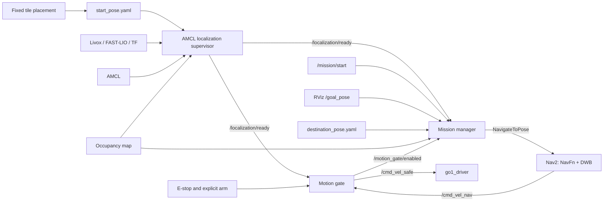

# Fixed-Start AMCL Navigation and Dual-Goal Mission Design

**Date:** 2026-08-13
**Status:** Canonical consolidated design
**Supersedes:** `2026-08-13-fixed-start-localization-safety-design.md` and `2026-08-13-dual-goal-mission-manager-design.md`

## 1. Objective

The GO1 is placed at the same floor-tile reference for each normal run. Software seeds and verifies AMCL from a commissioned start pose, so routine startup does not require an RViz initial-pose click.

The robot remains stationary after localization succeeds until the operator explicitly arms motion and supplies one of two goal commands:

1. `/mission/start`: navigate to one registered destination.
2. RViz `2D Goal Pose`: navigate to an arbitrary valid map pose.

Both paths use one mission manager, one Nav2 `NavigateToPose` action path, identical safety checks, and the same standalone motion gate.

## 2. Scope and Non-goals

Included:

- AMCL-only localization.
- Fixed-tile physical placement and commissioned automatic AMCL seeding.
- Independent scan-to-map validation before declaring localization ready.
- A fail-closed velocity gate and driver watchdog.
- One recorded destination, initially intended for the elevator-front waiting pose.
- Arbitrary RViz goals as an optional second interface.

Excluded:

- Other localization algorithms.
- Automatic departure when localization becomes ready.
- Multiple named destinations, waypoint queues, or automatic mission resume.
- A direct RViz-to-Nav2 bridge outside the mission manager.
- Direct Nav2 velocity output to `go1_driver`.

## 3. Architecture



NavFn is the global planner and DWB is the local controller in this ROS 2 stack. Runtime documentation should not call the controller DWA.

## 4. Runtime Pose Files

Field-measured poses stay outside the repository:

- `/mnt/t500/go1_runtime/start_pose.yaml`
- `/mnt/t500/go1_runtime/destination_pose.yaml`

Each file stores a `map`-frame planar pose: `x`, `y`, and `yaw`. Recorders write atomically and refuse accidental overwrite.

### Start pose behavior

| File state | `initial_pose_arm` | Behavior |
|---|---:|---|
| Not configured | `false` | `UNCOMMISSIONED`; no `/initialpose` publication |
| Not configured | `true` | Reject configuration |
| Valid | `false` | Load only; remain unarmed |
| Valid | `true` | Seed and verify AMCL |
| Configured but invalid | any | Reject configuration |

No guessed production start pose is committed.

### Destination behavior

| File state | `/mission/start` | RViz goal |
|---|---|---|
| Absent | Reject as `UNCONFIGURED_DESTINATION` | Still available after safety prerequisites pass |
| Valid | Available after safety prerequisites pass | Available after safety prerequisites pass |
| Configured but invalid | Reject manager configuration | Reject manager configuration |

This permits start commissioning first and destination commissioning later.

## 5. Start-Pose Commissioning

Commissioning is a field procedure performed once and repeated when the map or tile reference changes:

1. Align both front feet to the agreed tile edges and keep the GO1 fully stationary.
2. Latch E-stop and keep the motion gate disarmed.
3. Run map, sensors, FAST-LIO, AMCL, and the start-pose recorder.
4. Use RViz `2D Pose Estimate` only for this commissioning procedure.
5. Confirm AMCL convergence and map/scan overlay.
6. Collect 10 stable `/amcl_pose` samples.
7. Save robust median `x`, median `y`, and circular-mean `yaw` to the explicit runtime path.
8. Perform at least three cold-start trials before enabling routine automatic seeding.

The recorder rejects motion, stale samples, excessive covariance, and internally inconsistent sample sets.

## 6. AMCL Localization Supervisor

The supervisor alone declares localization readiness; it never commands velocity.

### Startup sequence

1. Validate the configured start-pose file.
2. Wait for the static map, AMCL, scan, odometry, and required TF.
3. Confirm the robot is stationary.
4. When armed, publish one `PoseWithCovarianceStamped` on `/initialpose`.
5. Verify AMCL convergence and independent scan-to-map agreement.
6. Publish ready only after all conditions hold continuously for 2.0 seconds.

Repeated seeding during a healthy session is prohibited. A new seed requires an explicit supervisor reset or a detected localization-session restart.

### Initial readiness criteria

All must hold:

- `/amcl_pose` was received after the current seed.
- TF resolves `map -> camera_init -> body` at the observation time.
- Pose, scan, odometry, and TF ages are each at most 0.30 seconds.
- AMCL x and y covariance are each at most `0.04 m²`.
- AMCL yaw variance is at most `0.0305 rad²`.
- AMCL mean is within `0.25 m` and `15 degrees` of the commissioned start.
- At least 100 valid scan beams and 10 consecutive scans are evaluated.
- Median map-endpoint residual is at most `0.15 m`.
- 80th-percentile residual is at most `0.30 m`.
- The complete condition set holds for 2.0 seconds.

The distance-to-start test applies only to initial readiness. After the robot begins moving, continuous readiness uses covariance, TF, freshness, scan agreement, and continuity; it does not require staying near the start.

### States and outputs

```text
BOOT -> UNCOMMISSIONED -> WAITING_FOR_INPUTS -> SEEDING -> VERIFYING -> READY
READY -> DEGRADED
DEGRADED -> RELOCALIZING -> VERIFYING
any unrecoverable configuration/frame error -> ERROR
```

- `/localization/ready`: 10 Hz `std_msgs/msg/Bool` heartbeat.
- `/localization/status`: transient-local state and reason.

### FAST-LIO/session restart detection

Any of these invalidates readiness immediately:

- Odometry frame ID changes.
- Sensor or odometry timestamp moves backwards.
- Pose jumps more than `0.50 m` or `20 degrees` within `0.50 s` without corresponding commanded motion.

The motion gate then outputs zero and the mission manager cancels the active goal. Recovery never resumes a goal automatically.

## 7. Standalone Motion Gate

The motion gate is a separate ROS 2 node and the sole velocity source for `go1_driver`.

Inputs:

- `/cmd_vel_nav`
- `/localization/ready`
- E-stop and explicit arm state

Outputs:

- `/cmd_vel_safe`
- `/motion_gate/enabled`: 10 Hz `std_msgs/msg/Bool` heartbeat
- `/motion_gate/status`

Control services:

- `/motion_gate/arm`: `std_srvs/srv/Trigger`; requests motion permission after E-stop and localization checks pass.
- `/motion_gate/disarm`: `std_srvs/srv/Trigger`; immediately clears permission and publishes zero velocity.

The arm request is not latched across node restarts, E-stop activation, or localization loss. A new explicit arm command is required after each of those events.

`/motion_gate/enabled` means that the robot has permission to accept a mission. It is true only when:

- Localization-ready is true and no older than 0.30 seconds.
- E-stop is released and motion is explicitly armed.
- The gate configuration is healthy.

It does not depend on already receiving a Nav2 velocity command; otherwise goal admission and command production would deadlock.

An incoming velocity command passes only when the gate is enabled and:

- The command is finite and no older than 0.25 seconds.
- Linear and angular values are within hard limits.

If the gate is disabled or the command check fails, the gate immediately publishes zero and reports the blocking reason. With no command present, output remains zero while the enabled heartbeat may remain true. `go1_driver` independently stops when `/cmd_vel_safe` is absent for 0.35 seconds.

Localization readiness never arms motion. Therefore AMCL may be ready while the robot remains completely stationary.

## 8. Mission Manager

`fixed_mission_manager` owns the operator-facing `NavigateToPose` action client.

### Fixed destination command

```bash
ros2 service call /mission/start std_srvs/srv/Trigger "{}"
```

It loads the one registered destination, checks safety and map validity, and sends it to Nav2.

### Arbitrary RViz command

RViz continues publishing `PoseStamped` on `/goal_pose`. The mission manager consumes, validates, and sends that pose through the same action path. RViz remains useful without bypassing safety.

### Common admission checks

Both goal sources require:

- Fresh `/localization/ready = true`, age at most 0.30 seconds.
- Fresh `/motion_gate/enabled = true`, age at most 0.30 seconds.
- Available `NavigateToPose` server.
- No mission in `SENDING`, `ACTIVE`, or `CANCELING`.
- Frame exactly `map`.
- Finite position and orientation.
- Valid normalized planar quaternion.
- Pose inside map bounds.
- Goal occupancy from 0 through 49.
- At least `0.35 m` clearance from occupied or unknown cells.

Unknown cells and occupancy values 50 or greater are rejected.

### Concurrency and cancellation

- A second fixed or RViz goal is rejected while a mission is sending, active, or canceling.
- No automatic replacement or queue exists.
- Explicit cancellation uses:

```bash
ros2 service call /mission/cancel std_srvs/srv/Trigger "{}"
```

- Loss of localization readiness or motion-gate enablement during a mission requests Nav2 cancellation immediately.
- Recovery requires a new explicit goal command.

### States and outputs

```text
BOOT -> UNCONFIGURED_DESTINATION or IDLE
IDLE/UNCONFIGURED_DESTINATION -> SENDING -> ACTIVE -> SUCCEEDED | FAILED | CANCELED
SENDING/ACTIVE -> CANCELING -> CANCELED
```

`UNCONFIGURED_DESTINATION` blocks fixed start only; a valid RViz goal may still be accepted.

- `/mission/status`: transient-local state, reason, and goal source.
- `/mission/active`: 10 Hz `std_msgs/msg/Bool` heartbeat.

Terminal status remains visible until the next accepted goal.

## 9. Destination Commissioning

1. Keep E-stop latched and the motion gate disabled.
2. Start the static map and destination recorder with an explicit output path.
3. Mark the elevator-front waiting pose and heading with RViz `2D Goal Pose`.
4. Apply the same bounds, occupancy, quaternion, and 0.35 m clearance rules as runtime.
5. Save atomically and refuse accidental overwrite.
6. Restart the manager and confirm `/mission/start` loads the pose.

The normal manager may also observe the commissioning `/goal_pose`, but it rejects navigation because `/motion_gate/enabled` is false. The recorder can still save it.

## 10. End-to-End Operation

### Normal fixed mission

1. Place the front feet on the commissioned tile marks.
2. Launch sensors, map, FAST-LIO, AMCL, supervisor, Nav2, gate, driver, and manager.
3. Supervisor seeds and verifies AMCL.
4. Wait for `/localization/ready = true`.
5. Inspect the scene, release E-stop, and explicitly arm motion.
6. Confirm `/motion_gate/enabled = true`.
7. Call `/mission/start`.
8. Manager validates and sends the registered goal.
9. NavFn builds the global path; DWB produces local velocity commands.
10. The motion gate forwards only safe commands to the driver.

### Arbitrary RViz mission

Steps 1-6 are identical. Then select RViz `2D Goal Pose`; the manager validates and sends the arbitrary goal through the same Nav2 and gate chain.

### Stop and recovery

E-stop, stale readiness, stale commands, invalid velocity values, localization degradation, or FAST-LIO restart produces zero velocity. Localization/gate loss also cancels the active action. After recovery, re-arm if needed and issue a new goal; nothing resumes automatically.

## 11. Failure Matrix

| Failure | Immediate behavior | Recovery |
|---|---|---|
| Start pose absent | No seed; readiness false | Commission/configure, then reset or restart |
| Invalid start pose | Configuration failure | Correct file |
| Destination absent | Fixed start rejected | Record it; RViz goals remain available |
| AMCL/scan/TF check fails | Zero velocity; active mission cancels | Restore readiness, then issue new goal |
| FAST-LIO restart/jump | Readiness false; zero; cancel | Reseed/reset, then issue new goal |
| E-stop pressed | Zero; gate heartbeat false | Release, arm, issue new goal |
| Goal is invalid | Reject before Nav2 | Choose or record a valid pose |
| New goal while active | Reject | Cancel or wait for terminal state |
| Nav2 action fails | Mission `FAILED`; watchdog stops | Diagnose and issue new goal |

## 12. Verification

Automated tests must cover:

- Pose-file parsing, atomic recording, and fail-closed invalid configuration.
- Robust start-pose estimation.
- Scan-to-map residuals and readiness hold time.
- Supervisor transitions and restart detection.
- Gate freshness, E-stop, numeric limits, zero output, and driver watchdog.
- Goal bounds, occupancy, unknown-cell clearance, and quaternion validation.
- Fixed/RViz arbitration, action outcomes, cancellation, and safety loss.
- Launch wiring proving one goal action path and one driver velocity input.

Robot tests must prove:

- Three cold starts from the tile without routine RViz initial-pose input.
- No nonzero `/cmd_vel_safe` before readiness and explicit arming.
- Fixed start rejects absent destination or unsafe prerequisites.
- Fixed and arbitrary RViz missions both work through the manager.
- A second goal is rejected while active.
- E-stop, AMCL degradation, and FAST-LIO restart stop motion and cancel the mission.
- No automatic departure or mission resume occurs.

## 13. Responsibility Boundaries

| Responsibility | Owner |
|---|---|
| Initial-pose storage and seeding | Localization supervisor |
| Localization truth | Localization supervisor |
| Physical permission to move | Motion gate |
| Fixed and arbitrary goal admission | Mission manager |
| Global path | NavFn |
| Local velocity generation | DWB |
| Final velocity boundary | Motion gate and driver watchdog |
| Start measurement | Start-pose recorder |
| Destination measurement | Destination recorder |

No UI click, pose estimate, planner result, or stale heartbeat can independently make the robot move.
