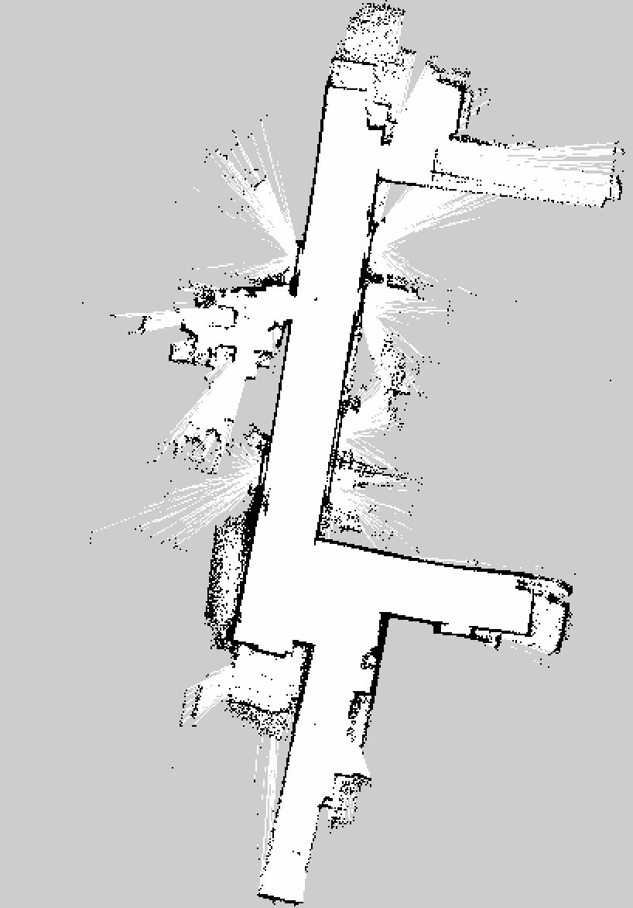
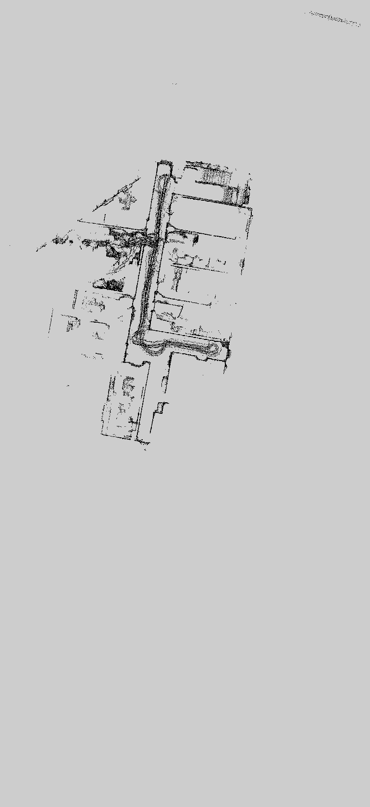

# 한양대학교 9층 Go1 매핑 결과

- 세션 ID: `20260728_204825`
- 취득일: 2026-07-28
- 센서: Livox MID-360
- 바닥 기준 센서 중심 높이: `0.21 m`
- 좌표계: `map_slam -> camera_init -> body`
- 상태: `complete`

## 지도 미리보기

### SLAM/내비게이션 지도



검정은 장애물, 흰색은 자유 공간, 회색은 미관측 영역이다. Nav2 등에서 사용하는 기본 지도는 `slam_toolbox/hanyang_9f.yaml`과 `slam_toolbox/hanyang_9f.pgm`이다.

### PCD 형상 참고 지도



`pcd2d/geometry_reference.yaml`은 3D PCD의 장애물 높이 구간을 2D로 투영한 형상 참고 자료이며, 직접적인 Nav2 주행 지도 용도가 아니다.

## 최종 검증 결과

- SLAM 지도: `409 x 586 px`, 해상도 `0.05 m/px`
- PCD 조각: 21개, SHA-256 중복 없음
- 병합 PCD: 114,519개 필터링 포인트
- 출발점 복귀 오차: `0.0697 m`, `4.96 deg`
- 입력률: LiDAR 약 `10 Hz`, IMU 약 `200 Hz`, Odometry 약 `10 Hz`
- guard 오류: 없음
- 최종 검증: `complete: true`, 오류 목록 없음

세부 파일 해시와 크기는 `validation/report.yaml`에 기록돼 있다.

## 산출물

| 경로 | 용도 |
|---|---|
| `slam_toolbox/hanyang_9f.yaml` | SLAM/Nav2 지도 메타데이터 |
| `slam_toolbox/hanyang_9f.pgm` | 2D occupancy 지도 |
| `slam_toolbox/hanyang_9f.posegraph` | slam_toolbox pose graph |
| `slam_toolbox/hanyang_9f.data` | slam_toolbox 직렬화 데이터 |
| `pcd/merged.pcd` | 전체 3D 병합 포인트클라우드 |
| `pcd2d/geometry_reference.*` | PCD 기반 형상 참고 지도 |
| `validation/health.yaml` | 센서·Odometry 상태와 복귀 오차 |
| `validation/report.yaml` | 전체 산출물 검증 및 SHA-256 |
| `validation/session_manifest.yaml` | 세션 상태와 토픽/프레임 정보 |

## Nav2 지도 사용 예시

```bash
ros2 run nav2_map_server map_server --ros-args \
  -p yaml_filename:=/path/to/slam_toolbox/hanyang_9f.yaml
```

실제 로봇에서 사용할 때는 절대 경로를 현재 설치 위치에 맞게 바꿔야 한다.

## 이번 작업에서 완료한 내용

- Jetson `unicon@192.168.0.138`에 매핑 코드 배포 및 ROS2 Humble 빌드
- MID-360 네트워크, LiDAR 약 10 Hz 및 IMU 약 200 Hz 실측 검증
- Jetson PCL/Humble 호환 문제와 PCD 파일 게시·종료 처리 수정
- FAST-LIO, pointcloud_to_laserscan, slam_toolbox, rosbag2 통합
- Python 콜백 오판을 제거하고 C++ 네이티브 토픽 주파수 감시기 추가
- 전체 152개 테스트 통과
- 실제 복도 주행, 폐루프 복귀, 2D/3D 지도 생성 및 검증
- 종료 후 확정된 21개 PCD 조각 전체를 높이 `0.21 m` 기준으로 재병합

slam_toolbox 자동 저장 서비스는 내부 map saver가 기본 `/map`을 기다리는 반면 이 프로젝트는 `/map_slam`을 사용하여 실패했다. 이번 지도는 `/map_slam`을 명시한 map saver로 정상 저장하고 posegraph를 직렬화한 뒤 전체 검증을 다시 통과시켰다.

## GitHub에서 제외한 원본 데이터

저장소 크기와 GitHub 파일 제한 때문에 다음 원본은 포함하지 않았다.

- 약 2.6 GiB rosbag 원본
- 21개 개별 PCD 조각
- 종료 중 생성된 불완전 압축 파일

원본 rosbag은 Jetson의 다음 위치에 보존돼 있다.

```text
/mnt/t500/maps/hanyang_9f/20260728_204825/bag/raw/raw_0.db3
```

DB 무결성 검사 결과는 `quick_check=ok`이며, 총 157,665개 메시지와 약 631초 기록을 `ros2 bag info`로 확인했다.